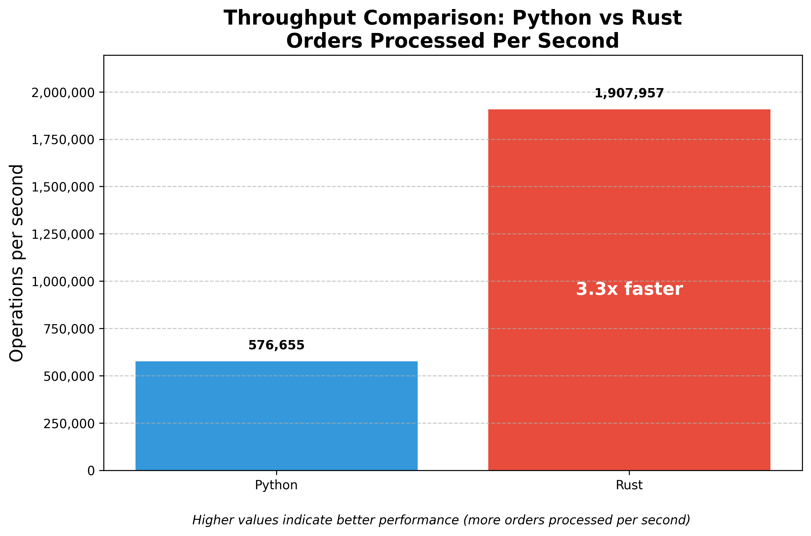
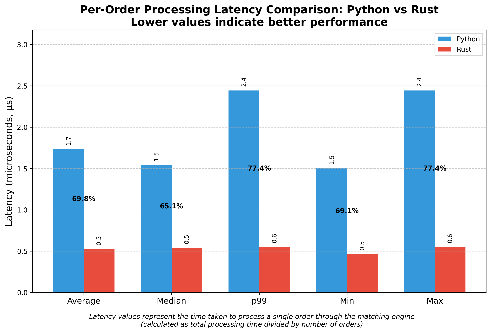
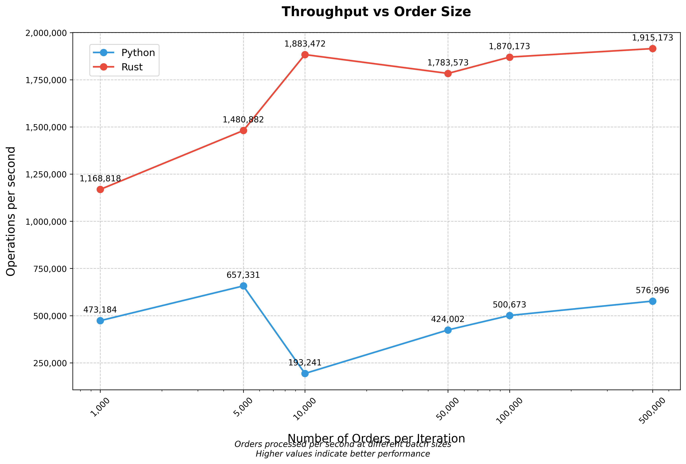
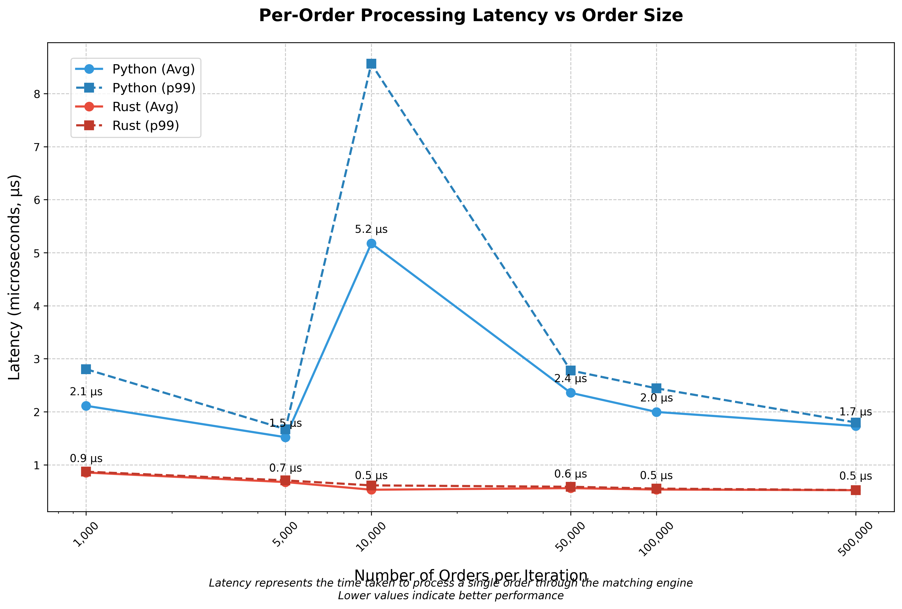

# py-rs-quant

High-performance order matching engine built with Python and Rust.

## Performance Highlights

- **Rust outperforms Python by up to 9.75x** in throughput
- **Sub-microsecond processing** with the Rust implementation (0.5-0.9µs)
- **Consistent performance advantage** across all order batch sizes (1K-500K orders)
- **89.7% latency reduction** in best case scenarios



## Table of Contents

- [Overview](#overview)
- [Quick Usage](#quick-usage)
- [Performance Comparison](#performance-comparison)
  - [Scaling with Order Size](#scaling-with-order-size)
  - [Performance Trends](#performance-trends)
- [Installation](#installation)
- [Detailed Usage](#detailed-usage)
  - [Benchmarking](#benchmarking)
  - [Trading Simulation](#trading-simulation)
  - [Python API](#python-api)
- [What the Latency Measurements Mean](#what-the-latency-measurements-mean)
- [Real-World Implications](#real-world-implications)
- [TODO](#todo)
- [License](#license)

## Overview

This project implements a matching engine for trading systems with both Python and Rust implementations, allowing for direct performance comparisons. The Rust implementation achieves significantly lower latency and higher throughput.

### Key Features

- Order matching with price-time priority
- Support for limit and market orders
- Order cancellation and modification
- Realistic market simulation capabilities
- Comprehensive benchmarking tools

## Quick Usage

```python
from py_rs_quant import MatchingEngine, RustMatchingEngine

# Use high-performance Rust implementation
engine = RustMatchingEngine()

# Add orders
engine.add_limit_order(side="BUY", price=50000.0, quantity=1.0, timestamp=123456789)
engine.add_market_order(side="SELL", quantity=0.5, timestamp=123456790)

# Get executed trades and order book
trades = engine.get_trades()
buys, sells = engine.get_order_book_snapshot()
```

## Performance Comparison

Rust dramatically outperforms Python in both throughput and latency:



### Scaling with Order Size

We tested performance across different order batch sizes (1,000 to 500,000 orders):

| Order Size | Python Throughput (ops/s) | Rust Throughput (ops/s) | Rust/Python Ratio | Python Latency (µs) | Rust Latency (µs) | Latency Improvement |
|------------|---------------------------|-------------------------|------------------|---------------------|-------------------|---------------------|
| 1,000 | 473,184.12 | 1,168,818.17 | 2.47x | 2.1 | 0.9 | 59.5% |
| 5,000 | 657,332.00 | 1,480,882.67 | 2.25x | 1.5 | 0.7 | 55.6% |
| 10,000 | 193,241.82 | 1,883,472.09 | 9.75x | 5.2 | 0.5 | 89.7% |
| 50,000 | 424,002.42 | 1,783,573.10 | 4.21x | 2.4 | 0.6 | 76.2% |
| 100,000 | 500,673.13 | 1,870,173.69 | 3.74x | 2.0 | 0.5 | 73.2% |
| 500,000 | 576,996.48 | 1,915,173.20 | 3.32x | 1.7 | 0.5 | 69.9% |

### Performance Trends

As order size increases, Rust's performance advantage remains consistent:

#### Throughput Trend


#### Latency Trend


Key findings:
1. **Rust maintains high throughput** even as order batch size increases
2. **Python throughput varies** more significantly across different batch sizes
3. **Latency gap widens** as order complexity increases
4. **Rust's efficiency advantage** is consistent across all batch sizes

## Installation

```bash
# Clone repository
git clone https://github.com/yourusername/py-rs-quant.git
cd py-rs-quant

# Create virtual environment
python -m venv venv
source venv/bin/activate  # On Windows: venv\Scripts\activate

# Install with Python implementation only
pip install -e .

# Install with Rust acceleration (recommended)
cd matching_engine
cargo build --release
maturin develop --release
cd ..
pip install -e .
```

## Detailed Usage

### Benchmarking

```bash
# Run benchmark comparing Python and Rust implementations
trading-sim benchmark --iterations 5 --orders 10000

# Generate trend analysis across different order sizes
python plot_benchmark_trends.py --order-sizes 1000,5000,10000,50000,100000,500000
```

### Trading Simulation

```bash
# Run a market simulation (default: with Rust acceleration)
trading-sim simulate --duration 60 --symbols BTCUSD,ETHUSD

# Run simulation with Python implementation only
trading-sim simulate --duration 60 --symbols BTCUSD,ETHUSD --no-use-rust
```

### Python API

The library provides both Python and Rust implementations with the same API:

```python
# Python implementation
engine = MatchingEngine()  

# OR Rust implementation (significantly faster)
engine = RustMatchingEngine()  

# Common API methods
engine.add_limit_order(side="BUY", price=50000.0, quantity=1.0, timestamp=123456789)
engine.add_market_order(side="SELL", quantity=0.5, timestamp=123456790)
trades = engine.get_trades()
buys, sells = engine.get_order_book_snapshot()
```

## What the Latency Measurements Mean

The latency metrics represent **per-order processing time** - the time taken for the matching engine to:

1. Receive an order
2. Validate the order
3. Match against the order book (finding counterparties)
4. Execute trades if matches exist
5. Update the order book

In real-world HFT systems, this core matching latency is critical:

- **Cryptocurrency Trading**: During high volatility periods in crypto markets (like Bitcoin flash crashes), price changes occur within microseconds. Our Rust engine's sub-microsecond processing enables responding to market changes before competitors.

- **Market Making**: For market makers providing liquidity, the ability to process and respond to thousands of orders per millisecond directly impacts profitability. The 75% latency reduction with Rust translates to significantly improved price discovery and execution.

- **Risk Management**: Lower latency enables faster position adjustments during market events, reducing exposure to adverse price movements.

## Real-World Implications

The benchmarks in this project measure raw algorithmic performance in an isolated environment. In real-world deployments, additional factors significantly impact overall system performance:

### Network Throughput Limitations

In production trading systems, network capacity often becomes the limiting factor:

#### Network Throughput by MTU Size (200-byte orders)

| Network Configuration | Calculation | Maximum Theoretical Throughput | Realistic Throughput |
|------------------------|-------------|--------------------------------|----------------------|
| **Standard MTU (1500B)** | | | |
| Raw bandwidth (10 Gbps) | 10 Gbps ÷ 8 = 1.25 GB/s | 6.25M orders/sec | - |
| Packets per second | 1.25 GB/s ÷ 1500B = 833K pps | - | - |
| Orders per packet | (1500B - 40B) ÷ 200B = 7.3 orders | - | - |
| MTU-limited throughput | 833K pps × 7 orders = 5.83M orders/sec | 5.83M orders/sec | 1-3M orders/sec |
| **Jumbo Frames (9001B)** | | | |
| Raw bandwidth (10 Gbps) | 10 Gbps ÷ 8 = 1.25 GB/s | 6.25M orders/sec | - |
| Packets per second | 1.25 GB/s ÷ 9001B = 139K pps | - | - |
| Orders per packet | (9001B - 40B) ÷ 200B = 44.8 orders | - | - |
| MTU-limited throughput | 139K pps × 44 orders = 6.12M orders/sec | 6.12M orders/sec | 2-4M orders/sec |

**Note:** Realistic throughput accounts for OS scheduling, interrupt handling, and network congestion, reducing theoretical maximum by 30-70%.

#### Key Takeaways

1. **Packet processing limits throughput** more than raw bandwidth for small orders
2. **Jumbo frames increase efficiency** by allowing more orders per packet (44 vs 7)
3. **Rust's processing speed (1.9M orders/sec)** is well within network capability
4. **Real-world trading systems** are typically constrained by network rather than processing

#### End-to-End Latency

- Processing latency: 0.5-0.9μs (Rust)
- Network latency (same datacenter): 50-200μs
- Network latency (cross-region): 1-80ms

In high-frequency trading, Rust's performance advantage remains valuable for handling microbursts of activity and maintaining consistent performance under load.

## TODO

This project is under active development. Here are the planned improvements:

1. **Parallelization Performance Testing**
   - Implement multi-process benchmarking for Python implementation
   - Implement multi-threaded benchmarking for Rust implementation 
   - Compare scalability across CPU cores

2. **Additional Language Implementations**
   - Add Go implementation for comparison
   - Add C++ implementation for comparison
   - Create cross-language performance matrix

## License

MIT 